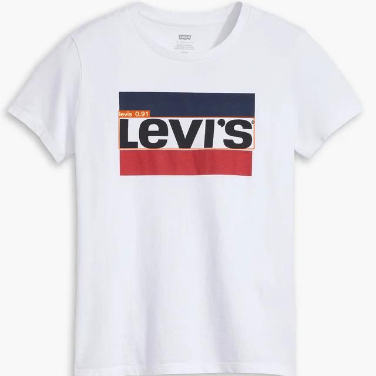
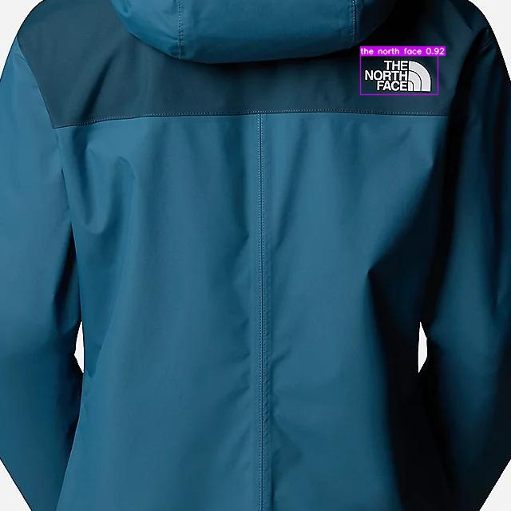
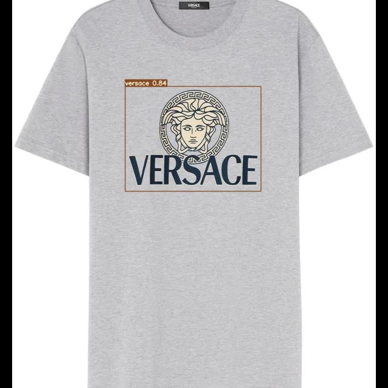

# Brand Logo Detection — YOLOv7 vs RTMDet

Comparison of **YOLOv7** and **RTMDet** for brand logo detection. Both models were trained on [LogoDet-3K](https://www.kaggle.com/datasets/lyly99/logodet3k) and fine-tuned on a custom dataset collected from the internet. RTMDet achieved better small-object recall.

> **Academic note:** This is a student project. All dataset samples are used solely for academic illustration purposes.

---

## Models

| Model | Backbone | Framework |
|-------|----------|-----------|
| YOLOv7 | E-ELAN + auxiliary heads | [WongKinYiu/yolov7](https://github.com/WongKinYiu/yolov7) |
| RTMDet-M | CSPNeXt + PAFPN | [MMDetection](https://github.com/open-mmlab/mmdetection) |

> ### 🔍 Key Finding
> RTMDet-M outperformed YOLOv7 on small-object recall while using significantly fewer parameters. The anchor-free design and improved feature pyramid allow more reliable localisation of small logo patches.

---

## Dataset

### LogoDet-3K

Primary training dataset — 604 logo categories, 31,266 annotated images.  
Download: [LogoDet-3K on Kaggle](https://www.kaggle.com/datasets/lyly99/logodet3k)

### Custom Dataset

Manually collected from the internet, labeled in YOLO format (`class_id cx cy w h`, normalised), and augmented per brand. 1300 images across multiple brand categories were used for fine-tuning.

---

## Results

### Detection Samples (with Bounding Boxes)

Fine-tuned model outputs on the custom test set.





---

## Weights

Trained weights (YOLOv7 + RTMDet, both pre-trained and fine-tuned) are hosted on Google Drive:

[Download Weights](https://drive.google.com/drive/folders/13lxC41ULiAe6bFJGp3Znt5EEgWU9T2B3)

Place downloaded files under `weights/`.

---

## Installation

```bash
git clone https://github.com/AeonMuffinz/brand-logo-detection.git
cd brand-logo-detection
pip install -r requirements.txt
```

---

## Training

### YOLOv7

Config files: `configs/yolov7/hyp.yaml` (hyperparameters), `configs/yolov7/opt.yaml` (training options).

```bash
# From the cloned yolov7 repo root:
python train.py \
  --data /path/to/data.yaml \
  --cfg cfg/training/yolov7.yaml \
  --weights yolov7.pt \
  --hyp /path/to/configs/yolov7/hyp.yaml \
  --batch-size 32 \
  --epochs 50 \
  --img 640 \
  --name logodet3k_yolov7
```

Key hyperparameters (`configs/yolov7/hyp.yaml`):

| Parameter | Value |
|-----------|-------|
| lr0 | 0.01 |
| lrf | 0.1 |
| momentum | 0.937 |
| weight_decay | 0.0005 |
| warmup_epochs | 3 |
| mosaic | 1.0 |
| mixup | 0.15 |
| fliplr | 0.5 |
| scale | 0.9 |

### RTMDet

Config: `configs/rtmdet/rtmdet_m_609cls.py`

```bash
python tools/train.py configs/rtmdet/rtmdet_m_609cls.py \
  --work-dir work_dirs/rtmdet_brand_logo
```

Key settings:

| Parameter | Value |
|-----------|-------|
| Model | RTMDet-M (CSPNeXt, widen=0.75, deepen=0.67) |
| Classes | 609 (LogoDet-3K) |
| Input size | 640 × 640 |
| Batch size | 48 |
| Max epochs | 300 |
| Base LR | 0.004 |
| Pretrained from | `rtmdet_m_8xb32-300e_coco_20220719_112220-229f527c.pth` |
| Pipeline switch epoch | 280 |

---

## Inference

### YOLOv7

```bash
# From the cloned yolov7 repo root:
python detect.py \
  --weights /path/to/weights/yolov7_finetuned.pt \
  --source /path/to/dataset/images/ \
  --conf-thres 0.4 \
  --img-size 640
```

### RTMDet

```bash
# Using MMDetection's inferencer:
python tools/test.py \
  configs/rtmdet/rtmdet_m_609cls.py \
  weights/rtmdet_finetuned.pth \
  --show-dir results/rtmdet_output
```
